# React Native Animation examples

The source code for the [Introduction to animation in React Native](https://whatdidilearn.info/2019/05/18/introduction-to-animation-in-react-native.html) article.

## Animation examples

### Motion

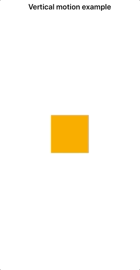

### Fade in / Fade out

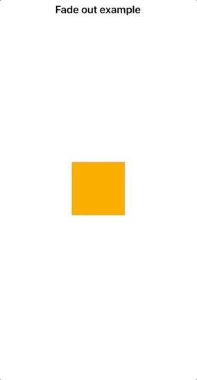

### Scale

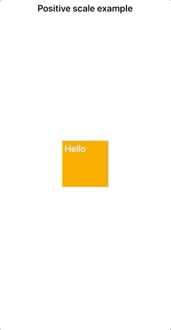
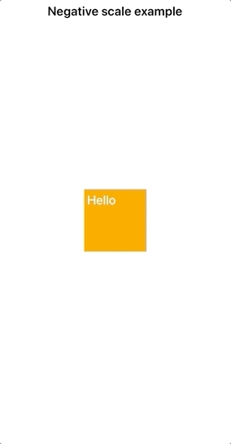

### Resize

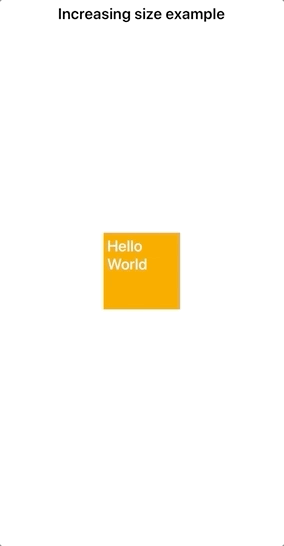

### Rotate

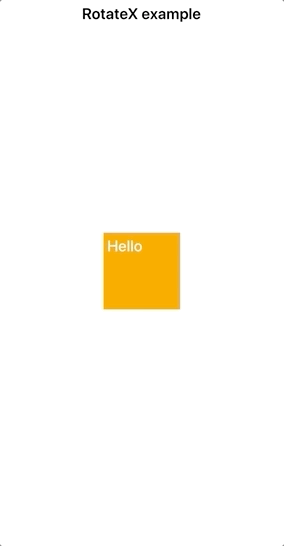
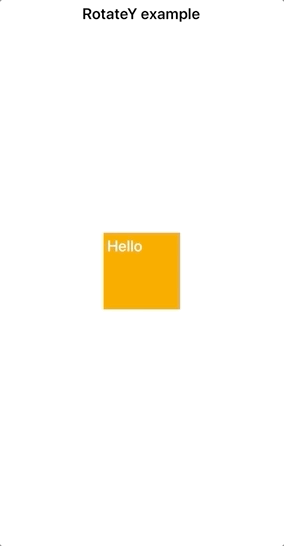

### Change color

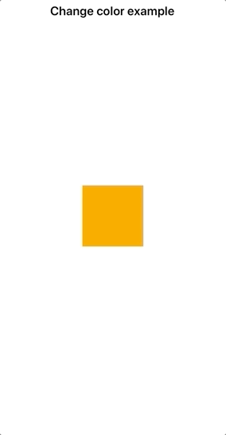

### Spring

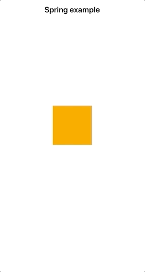

### Loop

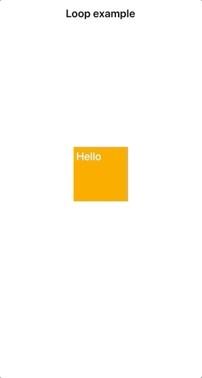

### Decay

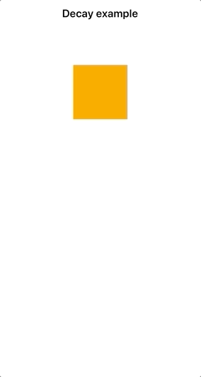

### Easing bounce

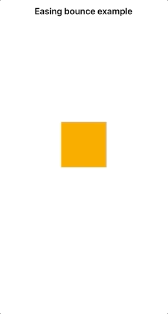

### Sequence

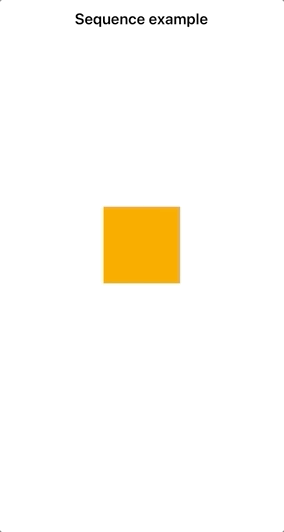

### Parallel

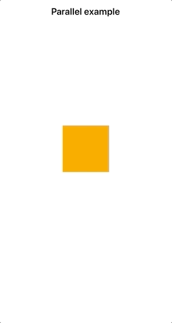

### Delay

### Stagger

