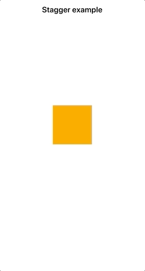

# React Native Animation examples

The source code for the [Introduction to animation in React Native](https://whatdidilearn.info/2019/05/18/introduction-to-animation-in-react-native.html) article.

## Animation examples

### Motion

### Fade in / Fade out

### Scale

### Resize

### Rotate

### Change color

### Spring

### Loop

### Decay

### Easing bounce

### Sequence

### Parallel

### Delay

### Stagger

